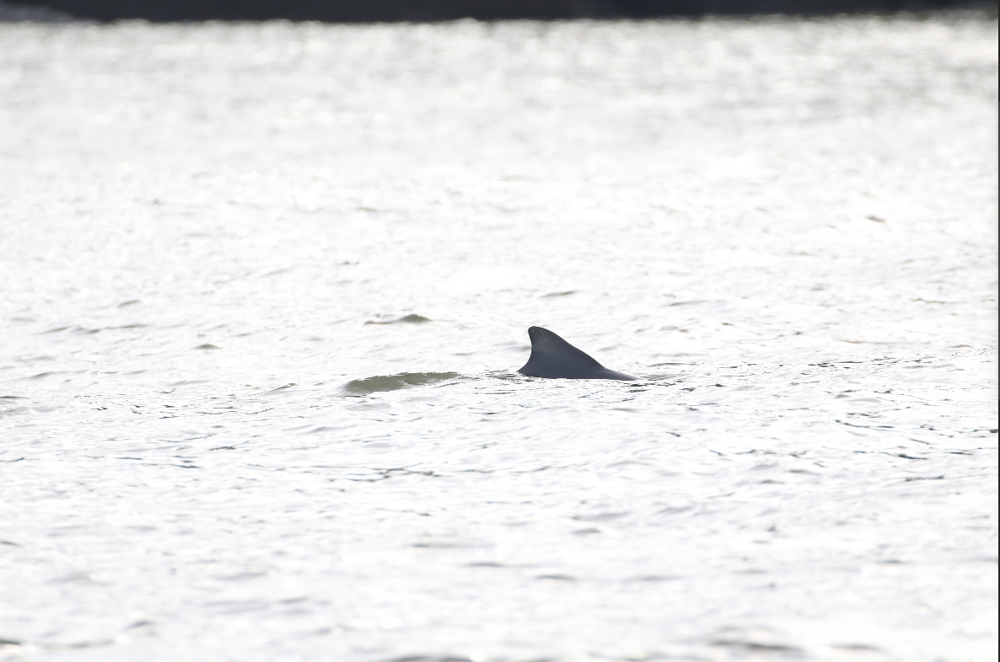
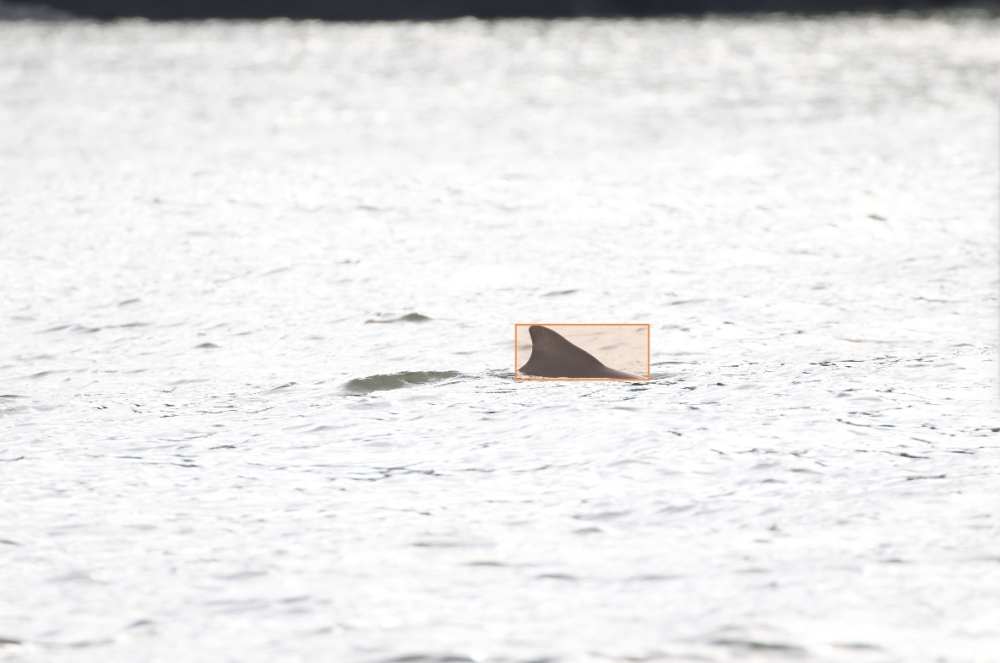

# 🐬 From Ocean Photos to Dolphin Identity

<i>A visual project to support dolphin monitoring, one image at a time.</i>

  
  

  Left: original dolphin image • Right: dolphin fin detection

---

## Why This Project Exists

Field campaigns produce large volumes of dolphin photos. Reviewing them manually takes significant time and effort.

This project helps reduce that workload by first detecting dolphin fins automatically, then supporting future identification of individual dolphins.

The broader goal is to turn raw photo collections into structured information that can support research and conservation decisions.

## Project Journey

1. **Step 1 - Fin Detection:** Completed.
2. **Step 2 - Individual Identification:** In progress.

## Current Focus

Detection is now established as the foundation.

The active phase is building the identification workflow so each detected fin can be linked to an individual dolphin.
